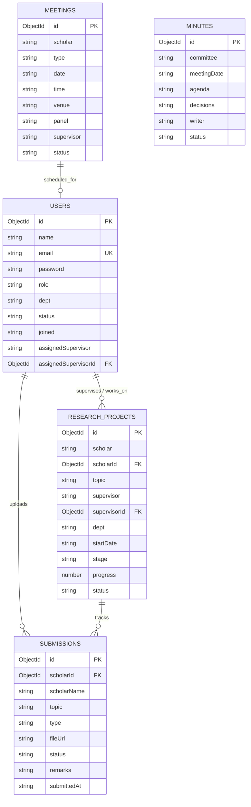

# RMS Platform Backend Analysis & Implementation Guide

This folder contains a complete analysis of the frontend implementation of the **Research Management System (RMS) Platform** and provides a roadmap for migrating this system into a fully functional client-server web application.

---

## 📂 Analysis Deliverables

We have generated the following specification sheets under the `analysis/` folder:

1. **`route-map.json`**: Translates every React router route and layout option directly to backend endpoints.
2. **`api-spec.json`**: Complete specification for JWT authentication, User Management CRUD, Projects management, meetings scheduling, and document submissions.
3. **`db-schema.json`**: MongoDB database collections, fields list, unique constraints, index definitions, and relationship descriptions.
4. **`seed-data.json`**: Default seed data for initial setup including users, research projects, settings, and mock schedules.
5. **`frontend-integration-snippets.md`**: Practical integration examples utilizing Axios fetch requests and file upload handling.

---

## 🏛️ DB Design & ER Diagram



---

## 🔐 Auth & Middleware Guard (Node.js Example)

Secure role-based routes on the Express API using standard authentication middleware:

```javascript
const jwt = require('jsonwebtoken');

const authenticateToken = (req, res, next) => {
  const authHeader = req.headers['authorization'];
  const token = authHeader && authHeader.split(' ')[1];
  
  if (!token) return res.status(401).json({ message: 'Authentication required' });

  jwt.verify(token, process.env.JWT_SECRET, (err, user) => {
    if (err) return res.status(403).json({ message: 'Invalid token' });
    req.user = user;
    next();
  });
};

const authorizeRoles = (...allowedRoles) => {
  return (req, res, next) => {
    if (!allowedRoles.includes(req.user.role)) {
      return res.status(403).json({ message: 'Access denied: Insufficient privileges' });
    }
    next();
  };
};

// Usage Example
app.post('/api/users', authenticateToken, authorizeRoles('admin'), createUserHandler);
```

---

## 📈 Prioritized Implementation Plan

| Phase | Feature Module | Scope of Work | Priority | Estimated Effort |
|---|---|---|---|---|
| **Phase 1** | Auth & User Database | Scaffold Node/Express backend, configure database connection, load `seed-data.json`, implement dynamic JWT login. | P0 | Medium |
| **Phase 2** | User Management & Allocation | Enable dynamic Admin CRUD on accounts and supervisor allocations (`AssignScholar.jsx`). | P0 | Medium |
| **Phase 3** | Research Projects & Stats | Connect project creation, stats tracking (`ResearchManagement.jsx`), and search report filters. | P1 | Small |
| **Phase 4** | Meeting & Viva scheduling | Connect virtual scheduling calendar inputs (`MeetingsManagement.jsx` & `DRCMeetingManagement.jsx`). | P1 | Medium |
| **Phase 5** | Document Uploads | Configure `multer` for multipart PDF file uploading, enabling supervisor/DRC review status approval loops. | P2 | Large |
